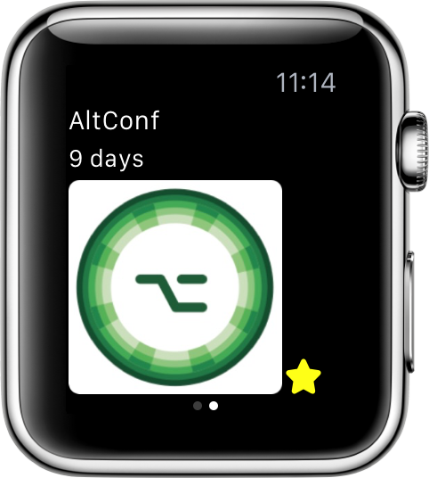

# Soon: A Demo WatchKit App

This this project shows one architecture for writing a WatchKit extension with an app and glance. In particular, it shows one way to sharing data between your iOS app and the extension.

The app itself is used for counting down to an event you're looking forward to. If you favorite an event, it will have higher priority in the Glance.

## Running

You want to add your own app container within the Xcode project configuration, under `App Groups`.

# Architecture

## Shared Data

Data is written to a shared app container, so everything is readable to both the app and extension.

As written in [technical note TN2408](https://developer.apple.com/library/ios/technotes/tn2408/_index.html).

> When you create a shared container for use by an app extension and its containing app in iOS 8.0 or later, you are obliged to write to that container in a coordinated manner to avoid data corruption.

An earlier version of this note warned against using NSFileCoordinator, and there are still blog posts out there that warn against it. But that was solved in iOS 8.2.

However, in this app, I'm using Core Data, which includes coordination at the system level.

## Update Notifications

When you make an update in your iPhone app, such as favoriting an event your WatchKit extension should be notified so it can refresh its UI.

One solution would be to use [Dispatch Sources](https://developer.apple.com/library/mac/documentation/General/Conceptual/ConcurrencyProgrammingGuide/GCDWorkQueues/GCDWorkQueues.html) and  `dispatch_source_create`, so you get notified whenever your data file is written to. But that can get hairy if you perform multiple writes in a row. Also, Core Data defaults to writing to multiple files. Finally, on the optimization side, I'd like to be able to coalesce write notifications.

I'm opting for explicitly sending a notification when it's time to refresh the data store. The most legit IPC option are Darwin notifications, but these aren't guarenteed to be delivered if your app in the background.

My solution: Whenever I perform a save in Core Data, I put a last-modified timestamp in NSUserDefaults. When the extension wakes up, it checks the timestamp. When it receives a notification, it checks the timestamp.

When you think about it, my extension acts like a web service client, which treats push notifications as "nice to have", but can always rely on the occasional polling.

## Write Operations

Shared state is hard. Things get easier when you have multiple readers, but only a single writer. One strategy in GCD is to contain writes to a single thread. I'm adopting this with processes.

When you favorite an event in this app, we change the state in the extension, but don't write anything. We send a request to the iOS app to actually perform the action.

Again, like a web service, we send only send parameters to the main app to perform the operation. We use the Core Data object URI to identify the upcoming event we're operating on.

# Performance

Take a look at `InterfaceManager`'s `updateInterfaceImage`.

## Uploading Images

Before being sent to the watch, images are converted to JPEG. Since the assets are coming from the camera roll, we assume they're photos, and compression will go undetected.

Since extensions have limited memory, we store a smaller version in the database when the user picks a photo in main iOS app. We resize it once more for the watch at runtime.

## Client Cache

When we store an image in our database, we also generate a UUID for use in the watch cache. We regularly diff our database with the watch cache, to purge images that are no longer there.